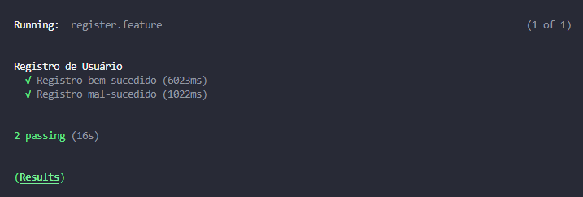

# Executando Testes Cypress em Modo Headless

Este repositório contém testes automatizados escritos usando Cypress para testar uma API de usuários.

## Pré-requisitos

Antes de executar os testes, certifique-se de ter  o Node.js e o gerenciador de pacotes npm instalados em seu sistema. Você pode fazer o download e instalar o Node.js a partir do [site oficial](https://nodejs.org/). 

Além disso, é necessário ter o Cucumber instalado para executar os testes usando esse framework de BDD (Behavior Driven Development). Você pode instalá-lo utilizando o npm:

`npm install cypress-cucumber-preprocessor --save-dev`

Também é necessário ter o Faker instalado para gerar dados falsos durante os testes. Você pode instalá-lo utilizando o npm:

`npm install @faker-js/faker --save-dev`

Execute o comando npm install (ou npm i para a versão curta) para instalar as dependências de desenvolvimento.

## Instalação

1. Clone este repositório em sua máquina local:

`git clone <URL_DO_REPOSITÓRIO>`

2. Abra o projeto do cypress no visual studio code

3. Abra o terminal do Visual Studio Code e instale o Cypress na sua máquina, para que seja instalado a pasta "node_modules":

`npm install cypress --save-dev`

4. Após isso, ainda no terminal do Visual Studio Code, rode os testes do cypress em modo headless por esse comando:

`npx cypress run --headless`

